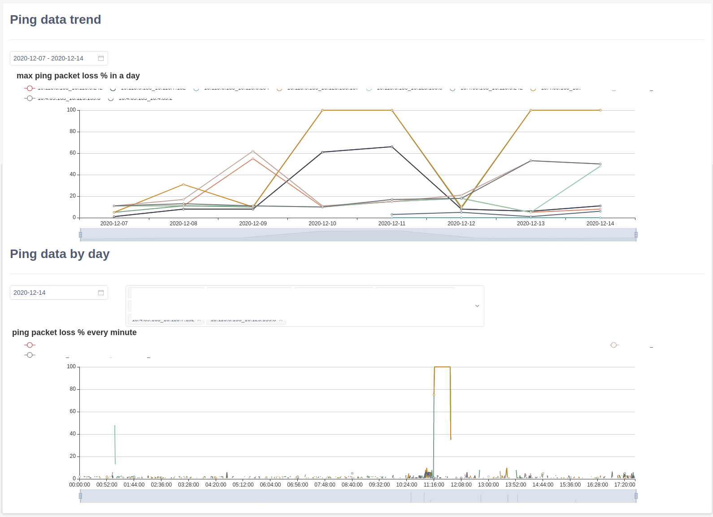

A tool to monitor with ping, collect ping data from different ip and show in charts.

## Usage

### Server

Install requirements in requirements.txt.

Modify the [local setting](https://zhangchunlin.gitee.io/uliweb-doc/zh_CN/uliweb3/settings.html) to configure ping sources and destinations, like:

```
[PINGDEST]
127.0.0.1 = [
  "baidu.com",
  "127.0.0.1",
]
```

If just want to have a try, you can run the test server:

```
uliweb runserver
```

Or refer [the steps](https://zhangchunlin.gitee.io/uliweb-doc/zh_CN/uliweb3/deployment.html) to setup this uliweb application as a web application.

### Client

For example, provide that server url is: http://localhost:8000/, In a python3.7+ environment, first install require package:

```
pip install aiohttp
```

then run:

```
curl -o pingmon.py http://localhost:8000/static/pingmon.py ;python pingmon.py -s http://localhost:8000/
```

## Screenshot

